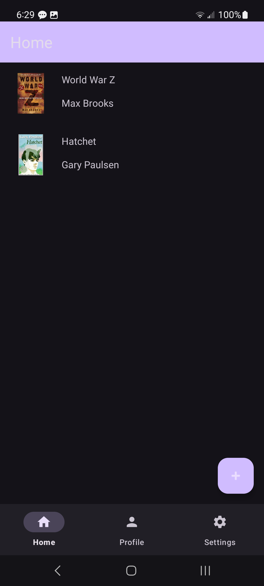
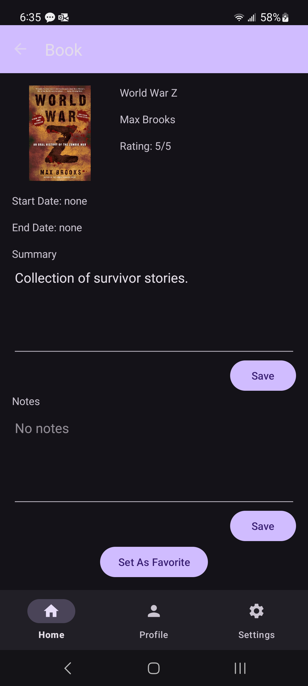
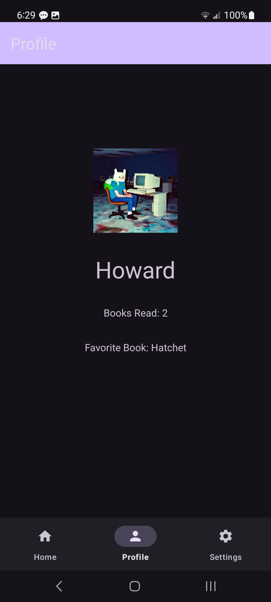
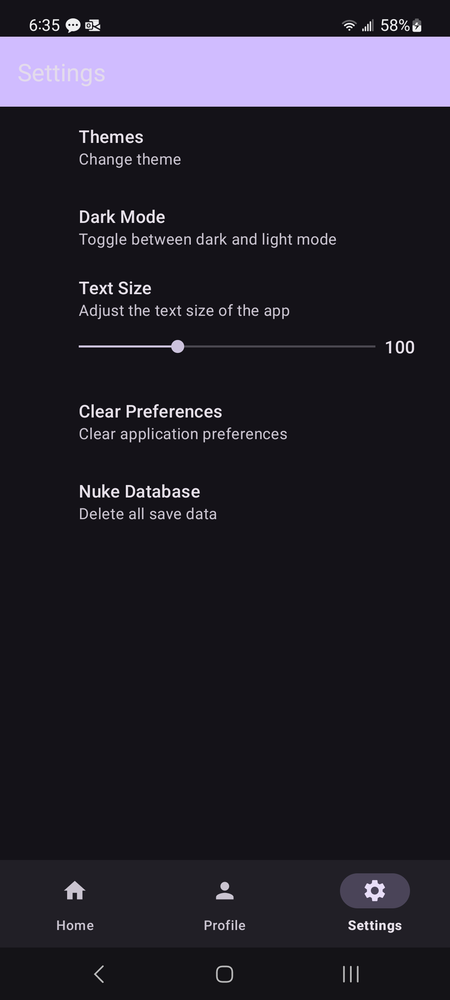
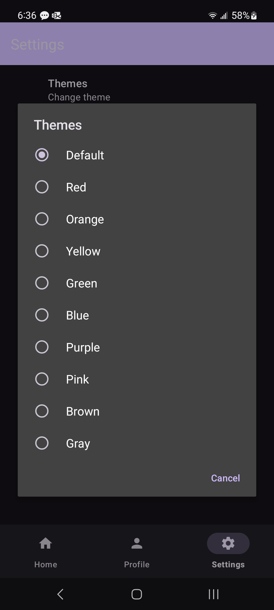

## About DragonScroll 🐉📖

DragonScroll is a personal book logger for Android with a focus on offline functionality. 

Written for UTSA's CS 3443 Application Programming semester project, DragonScroll uses local database and storage libraries to ensure that users can track their book reading habits at any place and time.

### Built With

   

### Features

* Adding / removing user book entries
* Editing entry titles, cover images, etc.
* User profile pictures and favorites
* Application themes 🎨

## Getting Started

### Prerequisites

Building DragonScroll requires to following to be installed on your machine:

1. Android Studio
2. A valid Android SDK

### Build The Project

1. Clone the DragonScroll GitHub repository

```bash
git clone https://github.com/joshuaeduque/DragonScroll.git dragonscroll
```

2. Navigaton to the cloned directory

```bash
cd dragonscroll
```

3. Build with gradlew

```bash
./gradlew build
```

Alternatively, you can simply open the cloned project in Android Studio and select `File -> Sync Project with Gradle Files` before building / executing on your device.

## Usage

Please note that while DragonScroll supports light mode, it was developed with dark mode in mind and should be used with such.

## Screenshots

<table>
    <tr>
        <th width="20%">Home</th>
        <th width="20%">Book</th>
        <th width="20%">Profile</th>
        <th width="20%">Settings</th>
        <th width="20%">Themes</th>
    </tr>
    <tr>
        <th></th>
        <th></th>
        <th></th>
        <th></th>
        <th></th>
    </tr>
</table>

## License

Distributed under the GNU General Public License v3.0. See `LICENSE` for more information.
